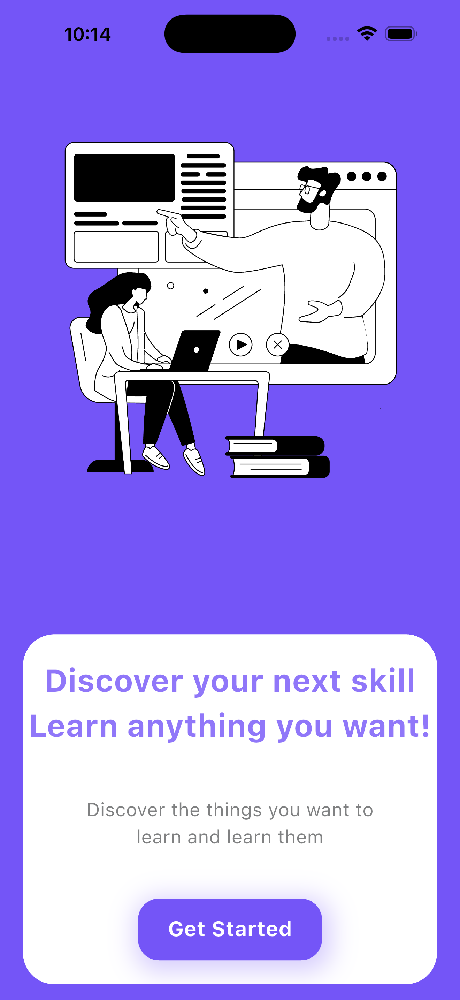

# 🎓 E-Learning UI — Flutter App

A modern, scalable, and visually engaging **E-Learning Mobile UI** built using Flutter.
This project focuses on **clean architecture, reusable components, and smooth user experience**, making it ready for real-world API integration.

---

## 🚀 Overview

The **E-Learning UI** is designed to simulate a production-ready learning platform interface, including category-based navigation, dynamic layouts, and animation-rich UI.

It demonstrates:

* Strong understanding of Flutter UI system
* Component reusability
* Scalable app structure for backend integration

---

## ✨ Key Features

* 📱 **Modern UI/UX Design**
* 🎞️ **Lottie Animations Integration**
* 🧩 **Reusable Widgets (Modular Design)**
* 🗂️ **Category-based Navigation System**
* ⚡ **Optimized Grid Layout (Responsive)**
* 🔄 **API-ready Architecture (MVC + GetX)**

---

## 📸 Screenshots

> *(Add your screenshots here for better impact)*

| OnBoarding Screen               | Home Screen                                  |
|---------------------------------|----------------------------------------------|
|  |  |

---

## 🧠 Architecture & Approach

This project follows a **scalable and maintainable structure**:

* Separation of concerns (UI / Logic / Data)
* Controller-based state management using GetX
* Modular folder structure for easy expansion

---

## 🛠️ Tech Stack

* **Flutter (UI Toolkit)**
* **Dart**
* **GetX** (State Management & Navigation)
* **Lottie** (Animation)

---

## 🔌 API Integration Ready

The app is structured to easily connect with backend services:

* Category-based product fetching
* Dynamic UI rendering
* Scalable controller architecture

---

## 🧪 Getting Started

### Clone the repository

```id="p7i2mn"
git clone https://github.com/khalid-zsh/E-Learning-UI.git
```

### Navigate to project

```id="w9k1de"
cd E-Learning-UI
```

### Install dependencies

```id="g4q2hs"
flutter pub get
```

### Run the app

```id="t6x8av"
flutter run
```

---

## 🔮 Future Enhancements

* 🔍 Search & Filtering System
* 📄 Course Details Page
* 🛒 Add to Cart / Checkout Flow
* ❤️ Wishlist System
* 🌐 Backend Integration (Live Data)
* 📱 Responsive Design (Tablet/Web)

---

## 👨‍💻 Author

**Khalid (Eyeshot)**
Flutter Developer | UI/UX Designer

* GitHub: https://github.com/khalid-zsh

---

## ⭐ Show Your Support

If you found this project useful or inspiring, consider giving it a ⭐ on GitHub!
